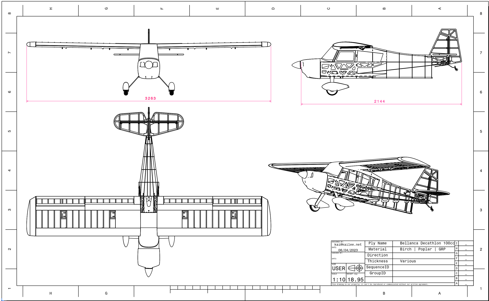

## BellancaDecathlon100CC

Data To Mill and Build a 3.26m Wingspan Bellanca Decathlon.

**** Update v1.6 ****

Some more smaller corrections to the following parts:

- W8_Rib_F_Poplar_3mm (was weirdly missing cutouts in the DXF/PDF that were pressent in the STEP)
- W16_Rib_N_Poplar_3mm (was missing cutout for W22_Web_D...)
- WJ4_Wing_Jig_D_Poplar_6mm (made cutouts for the ribs shallower so they sit on her as well as the stringer)

**** Update v1.6 ****

**** Update v1.5 ****

New parts
- W31A_Bracing_B_GRP_3mm
- W31B_Bracing_C_GRP_3mm
- W31C_Bracing_D_GRP_3mm

Updates to
- WJ3_Wing_Jig_C_Poplar_6mm
- WJ4_Wing_Jig_D_Poplar_6mm
- EH1_Horizontal_Stab_Poplar_3mm

and therefore updates to drawings
- Decathlon_100cc_v1.5_GRP_3mm.[dxf,pdf]
- Decathlon_100cc_v1.5_Poplar_6mm.[dxf,pdf]
- Decathlon_100cc_v1.5_Poplar_3mm_Fuselage.[dxf,pdf]

Please re-download the relevant data and/or plots if necessary.

**** End Update v1.5 ****

**** Update v1.4 ****

A couple more fixes on the wing and flap jigs;
New part
- WJ4_Wing_Jig_D_Poplar_6mm

Updates to
- W19_Web_A_Poplar_3mm
- W20_Web_B_Poplar_3mm
- W21_Web_C_Poplar_3mm
- W22_Web_D_Poplar_3mm
- W23_Web_E_Poplar_3mm

and therefore updates to drawings
- Decathlon_100cc_v1.4_Poplar_3mm_Wing.[dxf,pdf]
- Decathlon_100cc_v1.4_Poplar_6mm.[dxf,pdf]

Please re-download the relevant data and/or plots if necessary.

**** End Update v1.4 ****

**** Update v1.3 ****

A couple more fixes on the wing and flap jigs;
- WJ3_Wing_Jig_C_Poplar_6mm (x2)
- FJ2_Flap_Jig_C_Poplar_6mm
- FJ3_Flap_Jig_C_Poplar_3mm

Affected plots are
- Decathlon_100cc_v1.3_Poplar_6mm.[dxf,pdf]
- Decathlon_100cc_v1.3_Poplar_3mm_Wing.[dxf,pdf]

Please re-download the relevant data and/or plots if necessary.

**** End Update v1.3 ****

**** Update v1.2 ****

I was alerted to some errors in the second below mentioned thread, and fixed them. Affected parts are
- F1_Baseboard_Birch_6mm
- F6_Stringer_A_Poplar_3mm
- F7_Stringer_B_Poplar_3mm
- F27_Stringer_E_Poplar_3mm (2x)
- F31_Towhook_Plate_A_Poplar_3mm
- F32_Towhook_Plate_B_Poplar_3mm
- F46_Stringer_G_Poplar_6mm (2x)

Affected plots are
- Decathlon_100cc_v1.2_Birch_6mm.[dxf,pdf]
- Decathlon_100cc_v1.2_Poplar_3mm_Fuselage.[dxf,pdf]

Please re-download the relevant data and/or plots if necessary.

**** End Update v1.2 ****

This project was started based on Albert's downloadable data for the Bellanca Decathlon 100cc, and then over time every single part was re-drawn, re-constructed, and re-assembled - and then tidied up and labelled. The historic base and initial development of this project can be read through here:

[Bauplan Bellanca Super Decathlon](https://www.rc-network.de/threads/bauplan-bellanca-super-decathlon.563351/)

It is in German. If this is an issue, feel free to use Google to translate.

I have started a new thread on the same server to cover issues related to this data here:

[Fräsdaten Bellanca Decathlon 100cc](https://www.rc-network.de/threads/fr%C3%A4sdaten-bellanca-super-decathlon.11947862/)

If you intend to build this plane, this should probably be your starting point. Again, it is in German, but I will be more than happy to answer questions in english there also, as I'm sure most of the contributors in the thread will. I do ask that if you do intend to build a plane from this data, if possible also give feedback, either to me directly or better yet into the second thread listed. Let's keep this thing improving - for which I need feedback and suggestions to do stuff. I'm open to almost anything, I'll be happy to provide alternative parts (especially if provided by you, the reader), but make no promises. If I dont like or disagree with a suggestion it may not make it into the dataset. Please don't be upset if this happens.

The data available here is in STEP for the 3D data, and DXF and PDF for the plots. The plots are grouped by material and thickness, and are much larger than most mills will be (some are several meters wide). However if you have a mill you are probably more than capable of splitting these plots into managable groups. I think you all understand that I can't do plots for each and every guy and gal who wants to build one of these - I would be busy exporting dxf's for the rest of my life.

Please feel free to download any of the data here, and use it to build the plane, browse the parts in the STEP assembly, brew your own new parts, etc. The data is published under the cc-by-nc-sa license which you can read through in the link below. Essentially, it allows any use, _except_ for commercial use. Oh, regarding the STEP assembly. It is split up into the component parts, one file per part. There is however one assembly file that will pull all the other together. To my knowledge most modern CAD systems are capable of this nesting. If it is an issue then please let me know, I can do a one-file-to-conquer-them-all if needed.

Many thanks go to all who have contributed so far, but especially Albert, who made the initial dataset available. That dataset has been built and improved upon by a number of people, some of who have helped with suggestions and changes during my rebuilding work. They're all important, and I'm grateful to all of the input I received over the duration of the project so far. Please - if you do intend to build one of these - I really urge you to give further feedback. The more people let me know of needed or suggested changes, the more the quality will improve. However, if I disagree with one or the othe suggestion please don't feel offended that I don't put the change in. You can always download the 3D data and do it yourself!

I hope you all have some fun looking at the data, and maybe some of you milling some wood, and putting it all together.

Cheerio,

Kai.

## Creative Commons Attribution-NonCommercial 4.0 International Public License (CC BY-NC 4.0)

### You are free to:

 - **Share** -- copy and redistribute the material in any medium or format
 -  **Adapt** -- remix, transform, and build upon the material

### Under the following terms:

 - **Attribution** -- You must give  [appropriate credit](https://wiki.creativecommons.org/wiki/License_Versions#Detailed_attribution_comparison_chart), provide a link to the license, and [indicate if changes were made](https://wiki.creativecommons.org/wiki/License_Versions#Modifications_and_adaptations_must_be_marked_as_such). You may do so in any reasonable manner, but not in any way that suggests the licensor endorses you or your use.
 - **NonCommercial** -- You may not use the material for [commercial purposes](https://creativecommons.org/faq/#Does_my_use_violate_the_NonCommercial_clause_of_the_licenses.3F).
 

Shield: [![CC BY-NC-SA 4.0][cc-by-nc-sa-shield]][cc-by-nc-sa]

This work is licensed under a
[Creative Commons Attribution-NonCommercial-ShareAlike 4.0 International License][cc-by-nc-sa].

[![CC BY-NC-SA 4.0][cc-by-nc-sa-image]][cc-by-nc-sa]

[cc-by-nc-sa]: http://creativecommons.org/licenses/by-nc-sa/4.0/
[cc-by-nc-sa-image]: https://licensebuttons.net/l/by-nc-sa/4.0/88x31.png
[cc-by-nc-sa-shield]: https://img.shields.io/badge/License-CC%20BY--NC--SA%204.0-lightgrey.svg
